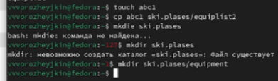
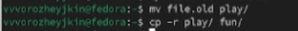
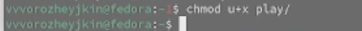
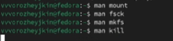

---
## Front matter
lang: ru-RU
title: Анализ файловой системы Linux.
subtitle: Простейший шаблон
author: |
      Ворожейкин Владимир Вячеславович \inst{1}
  
institute:
 \inst{1}Российский университет дружбы народов, Москва, Россия
date: 23 марта 2024, Москва, Россия

## Formatting
mainfont: PT Serif
romanfont: PT Serif
sansfont: PT Sans
monofont: PT Mono
toc: false
slide_level: 2
theme: metropolis
header-includes: 
 - \metroset{progressbar=frametitle,sectionpage=progressbar,numbering=fraction}
 - '\makeatletter'
 - '\beamer@ignorenonframefalse'
 - '\makeatother'
aspectratio: 43
section-titles: true

---

# Цели и задачи работы

## Цель лабораторной работы

Ознакомление с файловой системой Linux, её структурой, именами и содержанием
каталогов.

# Процесс выполнения лабораторной работы

## Копирование и переименовывание файла io.h 

{ #fig:001 width=70% height=70% }

## Создание директории ski.plases

{ #fig:002 width=70% height=70% }

## Перемещение файла equipment в каталог ski.plases

{ #fig:003 width=70% height=70% }

## Переименую файл ~/ski.plases/equipment в ~/ski.plases/equiplist

{ #fig:004 width=70% height=70% }

## Перемещаю файлы ~/ski.plases/equiplist и equiplist2 в каталог ~/ski.plases/equipment

{ #fig:005 width=70% height=70% }

## Создаю и перемещаю каталог ~/newdir в каталог ~/ski.plases и называю его plans

{ #fig:006 width=70% height=70% }

## Создаю все необходимые файлы и каталоги

{ #fig:007 width=70% height=70% }

## Использую команду chmod для того, чтобы присвоить перечисленным ниже файлам выделенные права доступа 

{ #fig:008 width=70% height=70% }

## Просмотр содержимого файла /etc/password

{ #fig:009 width=70% height=70% }

## Копирую файл ~/feathers в файл ~/file.old

{ #fig:010 width=70% height=70% }

## Переместите файл ~/file.old в каталог ~/play. Копирую каталог ~/play в каталог ~/fun.

{ #fig:011 width=70% height=70% }

## Перемещаю каталог ~/fun в каталог ~/play и называю его games. Лишаю владельца файла ~/feathers права на чтение

{ #fig:012 width=70% height=70% }

## Лишаю владельца каталога ~/play права на выполнение

{ #fig:013 width=70% height=70% }

## Даю владельцу каталога ~/play право на выполнение

{ #fig:014 width=70% height=70% }

## Читаю man по командам mount, fsck, mkfs, kill

{ #fig:015 width=70% height=70% }

## Вывод

Во время выполнения данной лабораторной работы я приобрел практические навыки по применению команд для работы с файлами и каталогами, по управлению процессами, по проверке использования диска и обслуживанию файловой системы.

