---
## Front matter
title: "Лабораторная работа №7"
subtitle: "Отчет"
author: "Ворожейкин Владимир Вячеславович"

## Generic otions
lang: ru-RU
toc-title: "Содержание"

## Bibliography
bibliography: bib/cite.bib
csl: pandoc/csl/gost-r-7-0-5-2008-numeric.csl

## Pdf output format
toc: true # Table of contents
toc-depth: 2
lof: true # List of figures
lot: true # List of tables
fontsize: 12pt
linestretch: 1.5
papersize: a4
documentclass: scrreprt
## I18n polyglossia
polyglossia-lang:
  name: russian
  options:
	- spelling=modern
	- babelshorthands=true
polyglossia-otherlangs:
  name: english
## I18n babel
babel-lang: russian
babel-otherlangs: english
## Fonts
mainfont: PT Serif
romanfont: PT Serif
sansfont: PT Sans
monofont: PT Mono
mainfontoptions: Ligatures=TeX
romanfontoptions: Ligatures=TeX
sansfontoptions: Ligatures=TeX,Scale=MatchLowercase
monofontoptions: Scale=MatchLowercase,Scale=0.9
## Biblatex
biblatex: true
biblio-style: "gost-numeric"
biblatexoptions:
  - parentracker=true
  - backend=biber
  - hyperref=auto
  - language=auto
  - autolang=other*
  - citestyle=gost-numeric
## Pandoc-crossref LaTeX customization
figureTitle: "Рис."
tableTitle: "Таблица"
listingTitle: "Листинг"
lofTitle: "Список иллюстраций"
lotTitle: "Список таблиц"
lolTitle: "Листинги"
## Misc options
indent: true
header-includes:
  - \usepackage{indentfirst}
  - \usepackage{float} # keep figures where there are in the text
  - \floatplacement{figure}{H} # keep figures where there are in the text
---

# Цель работы

Ознакомление с файловой системой Linux, её структурой, именами и содержанием
каталогов. 

# Задание

Использовать команды для работы с файлами и каталогами;
Использовать перемещение и переименование файлов и каталогов;
Научиться настраивать права доступа;

# Выполнение лабораторной работы

Создаю файл abc1 и просматриваю его (рис.[-@fig:001]):

 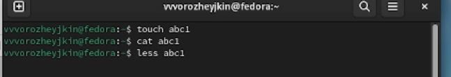{#fig:001 width=70% height=70%}

 Копирую файл abc1 в файл april и в файл may (рис.[-@fig:002]):

 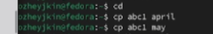{#fig:002 width=70% height=70%}

 Копирую файлы april и may в каталог monthly (рис.[-@fig:003]):
 
 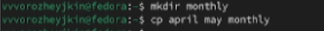{#fig:003 width=70% height=70%}
 
 Копирую файл monthly/may в файл с именем june (рис.[-@fig:004]):
 
 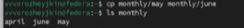{#fig:004 width=70% height=70%}
 
  Копирую каталог monthly в каталог monthly.00 (рис.[-@fig:005]):
  
 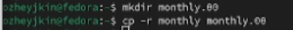{#fig:005 width=70% height=70%}
 
 Копирую каталог monthly.00 в каталог /tmp (рис.[-@fig:006]):
 
 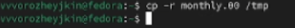{#fig:006 width=70% height=70%}
 
 Изменяю название файла april на july в домашнем каталоге (рис.[-@fig:007]):
 
 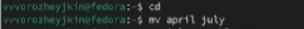{#fig:007 width=70% height=70%}
 
 Перемещаю файл july в каталог monthly.00 (рис.[-@fig:008]):
 
 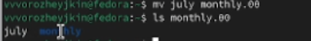{#fig:008 width=70% height=70%}
 
 Переименовать каталог monthly.00 в monthly.01 (рис.[-@fig:009]):
 
 {#fig:009 width=70% height=70%}
 
 Перемещаю каталог monthly.01 в каталог reports (рис.[-@fig:010]):
 
 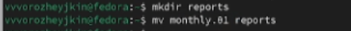{#fig:010 width=70% height=70%}
 
 Переименовываю каталог reports/monthly.01 в reports/monthly (рис.[-@fig:011]):
 
 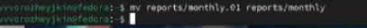{#fig:011 width=70% height=70%}
 
 Создаю файл may с правом выполнения для владельца (рис.[-@fig:012]):
 
 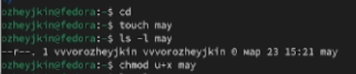{#fig:012 width=70% height=70%}
 
 Лишаю владельца файла may права на выполнение (рис.[-@fig:013]):
 
 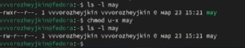{#fig:013 width=70% height=70%}
 
 Создаю каталог monthly с запретом на чтение для членов группы и всех остальных пользователей (рис.[-@fig:014]):
 
 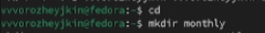{#fig:014 width=70% height=70%}
 
 Запрет на чтение (рис.[-@fig:015]):
 
 {#fig:015 width=70% height=70%}
 
 Создаю файл abc1 с правом записи для членов группы (рис.[-@fig:016]):
 
 {#fig:016 width=70% height=70%}
 
 Копирую файл io.h и переименовываю его в equipment (рис.[-@fig:017]):
 
 {#fig:017 width=70% height=70%}
 
 Создаю директорию ~/ski.plases (рис.[-@fig:018]):
 
 {#fig:018 width=70% height=70%}
 
 Проверяю содержимое директории (рис.[-@fig:019]):
 
 {#fig:019 width=70% height=70%}
 
 Создаю в домашнем каталоге файл abc1 и копирую его в каталог
~/ski.plases, называю его equiplist2 (рис.[-@fig:020]):

{#fig:020 width=70% height=70%}

 Перемещаю файлы ski.plases/equiplist и equiplist2 в каталог ski.plases/equipment (рис.[-@fig:021]):
 
 {#fig:021 width=70% height=70%}
 
 Создаю и перемещаю каталог ~/newdir в каталог ~/ski.plases и называю
его plans (рис.[-@fig:022]):

{#fig:022 width=70% height=70%}

Создаю необходимые директории и файлы (рис.[-@fig:023]):

{#fig:023 width=70% height=70%}

Определяю опции команды chmod, необходимые для того, чтобы присвоить перечисленным ниже файлам выделенные права доступа (рис.[-@fig:024]):

{#fig:024 width=70% height=70%}

Просматриваю содержимое файла etc/passwd (рис.[-@fig:025]):

{#fig:025 width=70% height=70%}

Копирую файл feathers в файл file.old (рис.[-@fig:026]):

{#fig:026 width=70% height=70%}

Перемещаю файл file.old в каталог play. Копирую каталог play в каталог fun (рис.[-@fig:027]):

{#fig:027 width=70% height=70%}

Перемещаю каталог fun в каталог play и называю его games. Лишаю владельца файла feathers права на чтение (рис.[-@fig:028]):

{#fig:028 width=70% height=70%}

Лишаю владельца каталога play права на чтение (рис.[-@fig:029]):

{#fig:029 width=70% height=70%}

Даю владельцу каталога play право на выполнение (рис.[-@fig:030]):

{#fig:030 width=70% height=70%}

Читаю man по командам mount, fsck, mkfs, kill (рис.[-@fig:031]):

{#fig:031 width=70% height=70%}

# Выводы

Во время выполнения данной лабораторной работы я приобрел практические навыки по применению команд для работы с файлами и каталогами, по управлению процессами, по проверке использования диска и обслуживанию файловой системы.

# Список литературы{.unnumbered}

::: https://esystem.rudn.ru/pluginfile.php/2288520/mod_resource/content/4/005-lab_files.pdf
