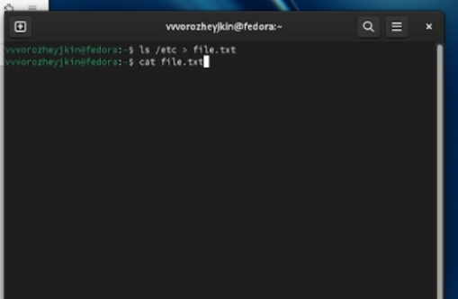
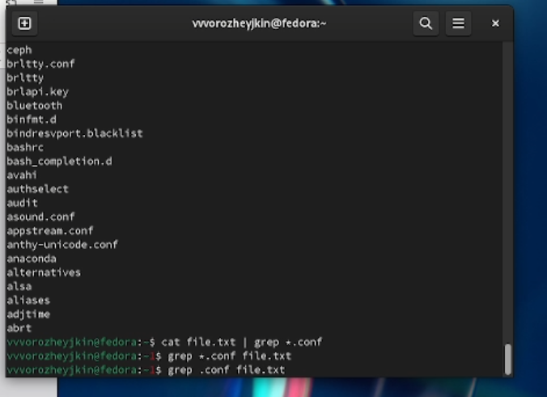
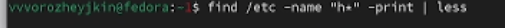
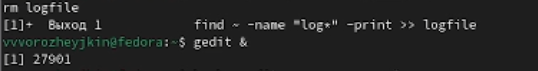
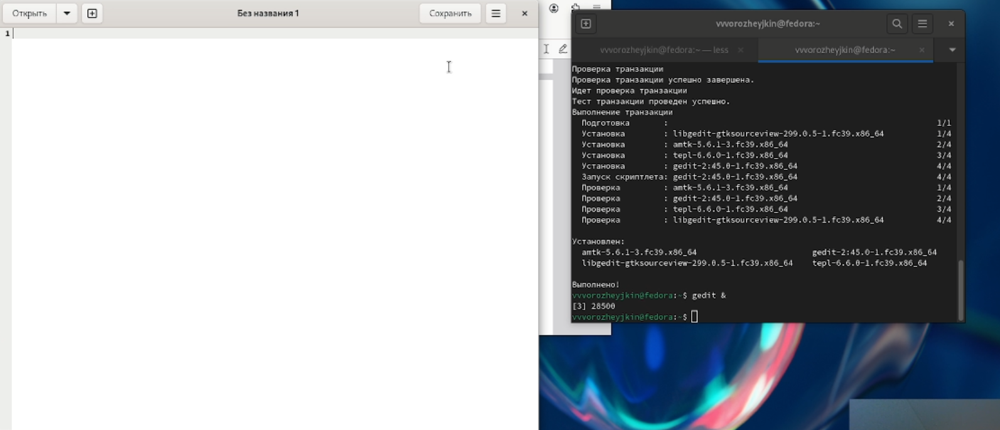
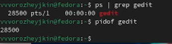
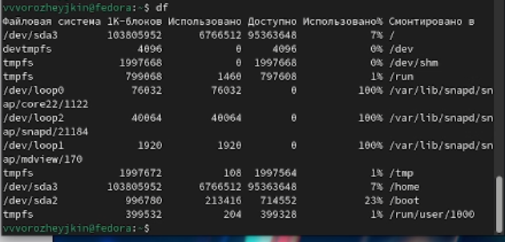
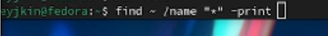

---
## Front matter
lang: ru-RU
title: Поиск файлов. Перенаправление ввода-вывода. Просмотр запущенных процессов.
subtitle: 
author: |
      Ворожейкин Владимир Вячеславович \inst{1}
  
institute:
 \inst{1}Российский университет дружбы народов, Москва, Россия
date: 30 марта 2024, Москва, Россия

## Formatting
mainfont: PT Serif
romanfont: PT Serif
sansfont: PT Sans
monofont: PT Mono
toc: false
slide_level: 2
theme: metropolis
header-includes: 
 - \metroset{progressbar=frametitle,sectionpage=progressbar,numbering=fraction}
 - '\makeatletter'
 - '\beamer@ignorenonframefalse'
 - '\makeatother'
aspectratio: 43
section-titles: true

---

# Цели и задачи работы

## Цель лабораторной работы

Ознакомление с инструментами поиска файлов и фильтрации текстовых данных.
Приобретение практических навыков: по управлению процессами (и заданиями), по
проверке использования диска и обслуживанию файловых систем.

# Процесс выполнения лабораторной работы

## Записываю в файл file.txt названия файлов, содержащихся в каталоге /etc

{ #fig:001 width=70% height=70% }

## Вывожу имена всех файлов из file.txt, имеющих расширение .conf

{ #fig:002 width=70% height=70% }

## Вывожу имена файлов, начинающихся с символа С

{ #fig:003 width=70% height=70% }

## Вывожу на экран имена файлов из каталога /etc, начинающиеся с символа h.

{ #fig:004 width=70% height=70% }

## Удаляю файл ~/logfile

{ #fig:005 width=70% height=70% }

## Запускаю редактор gedit

{ #fig:006 width=70% height=70% }

## Определяю идентификатор процесса редактора

{ #fig:007 width=70% height=70% }

## Завершаю процесс редактора с помощью команды kill

{ #fig:008 width=70% height=70% }

## Выполняю команды df и du

{ #fig:009 width=70% height=70% }

## Использую команду find, выведите имена всех директорий, имеющихся в вашем домашнем каталоге.

{ #fig:010 width=70% height=70% }

## Вывод

Во время выполнения данной лабораторной работы я приобрел практические навыки по поиску файлов и просмотру запущенных процессов.
