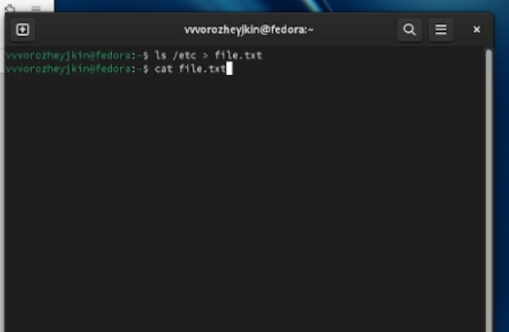
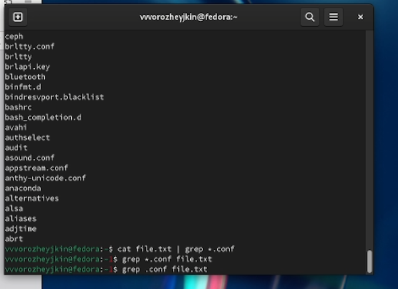
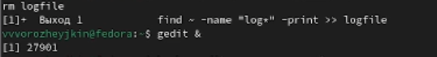
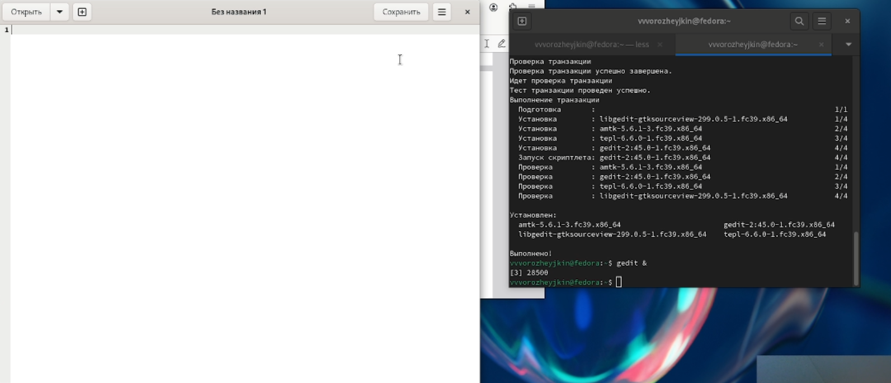
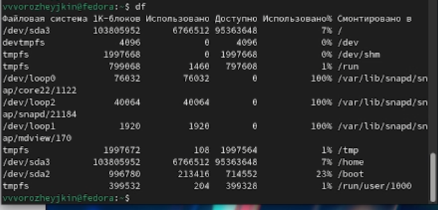
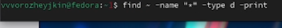

---
## Front matter
title: "Лабораторная работа №8"
subtitle: "Отчет"
author: "Ворожейкин Владимир Вячеславович"

## Generic otions
lang: ru-RU
toc-title: "Содержание"

## Bibliography
bibliography: bib/cite.bib
csl: pandoc/csl/gost-r-7-0-5-2008-numeric.csl

## Pdf output format
toc: true # Table of contents
toc-depth: 2
lof: true # List of figures
lot: true # List of tables
fontsize: 12pt
linestretch: 1.5
papersize: a4
documentclass: scrreprt
## I18n polyglossia
polyglossia-lang:
  name: russian
  options:
	- spelling=modern
	- babelshorthands=true
polyglossia-otherlangs:
  name: english
## I18n babel
babel-lang: russian
babel-otherlangs: english
## Fonts
mainfont: PT Serif
romanfont: PT Serif
sansfont: PT Sans
monofont: PT Mono
mainfontoptions: Ligatures=TeX
romanfontoptions: Ligatures=TeX
sansfontoptions: Ligatures=TeX,Scale=MatchLowercase
monofontoptions: Scale=MatchLowercase,Scale=0.9
## Biblatex
biblatex: true
biblio-style: "gost-numeric"
biblatexoptions:
  - parentracker=true
  - backend=biber
  - hyperref=auto
  - language=auto
  - autolang=other*
  - citestyle=gost-numeric
## Pandoc-crossref LaTeX customization
figureTitle: "Рис."
tableTitle: "Таблица"
listingTitle: "Листинг"
lofTitle: "Список иллюстраций"
lotTitle: "Список таблиц"
lolTitle: "Листинги"
## Misc options
indent: true
header-includes:
  - \usepackage{indentfirst}
  - \usepackage{float} # keep figures where there are in the text
  - \floatplacement{figure}{H} # keep figures where there are in the text
---

# Цель работы

Ознакомление с инструментами поиска файлов и фильтрации текстовых данных.
Приобретение практических навыков: по управлению процессами (и заданиями), по
проверке использования диска и обслуживанию файловых систем.

# Задание

Поиск нужных файлы;
Работа с редактором gedit.

# Выполнение лабораторной работы

Записываю в файл file.txt названия файлов, содержащихся в каталоге /etc.(рис.[-@fig:001]):

 {#fig:001 width=70% height=70%}
 
 Вывожу имена всех файлов из file.txt, имеющих расширение .conf (рис.[-@fig:002]):
 
 {#fig:002 width=70% height=70%}
 
 Вывожу имена всех файлов из file.txt, имеющих расширение .conf (рис.[-@fig:003]):
 
 {#fig:003 width=70% height=70%}
 
 Записываю их в новый текстовой файл conf.txt (рис.[-@fig:004]):
 
 {#fig:004 width=70% height=70%}
 
 Вывожу названия файлов с именами, начинающимися с символа С (рис.[-@fig:005]):
 
 {#fig:005 width=70% height=70%}
 
 Вывожу названия файлов с именами, начинающимися с символа С с помощью различных команд (рис.[-@fig:006]):
 
 {#fig:006 width=70% height=70%}
 
 Вывожу на экран имена файлов из каталога /etc, начинающиеся с символа h (рис.[-@fig:007]):
 
  {#fig:007 width=70% height=70%}
  
 Удаляю файл logfile (рис.[-@fig:008]):
 
 {#fig:008 width=70% height=70%}
 
 Запускаю редактор gedit (рис.[-@fig:009]):
 
 {#fig:009 width=70% height=70%}
 
 Определяю идентификатор процесса gedit, используя команду ps (рис.[-@fig:010]):
 
 {#fig:010 width=70% height=70%}
 
 Использую команду man kill (рис.[-@fig:011]):
 
 {#fig:011 width=70% height=70%}
 
 Завершаю с ее помощью процесс работы gedit 
 
 {#fig:012 width=70% height=70%}
 
 Выполняю команды df и du (рис.[-@fig:012]):
 
 {#fig:013 width=70% height=70%}
 
 Выполняю команду df (рис.[-@fig:013]):
 
 {#fig:014 width=70% height=70%}
 
 С помощью команды man find, вывожу имена всех директорий, имеющихся в домашнем каталоге (рис.[-@fig:014]):
 
 {#fig:015 width=70% height=70%}
 
 С помощью команды find, вывожу имена всех директорий, имеющихся в домашнем каталоге (рис.[-@fig:015]):
 
 {#fig:016 width=70% height=70%}
 
 С помощью команды find, вывожу имена всех директорий, имеющихся в домашнем каталоге (рис.[-@fig:016]):
 
 {#fig:017 width=70% height=70%}
 
# Выводы

Во время выполнения данной лабораторной работы я приобрел практические навыки по поиску файлов и просмотру запущенных процессов.

# Список литературы{.unnumbered}

https://esystem.rudn.ru/pluginfile.php/2288522/mod_resource/content/4/006-lab_proc.pdf
