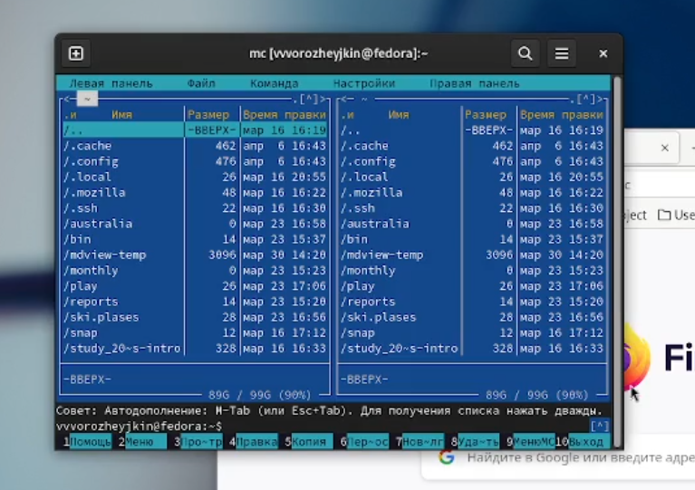
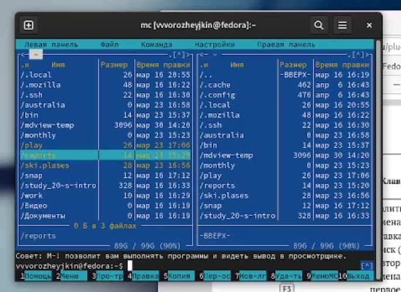
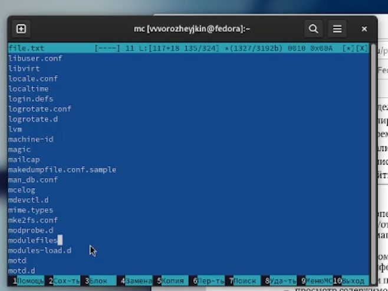
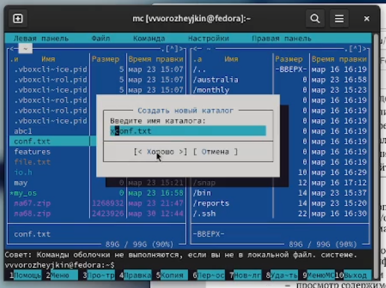
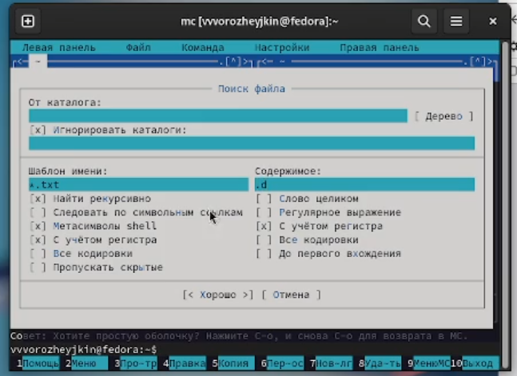
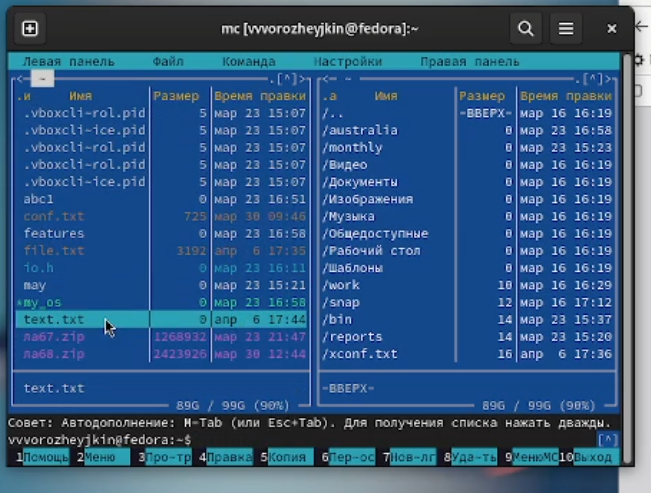
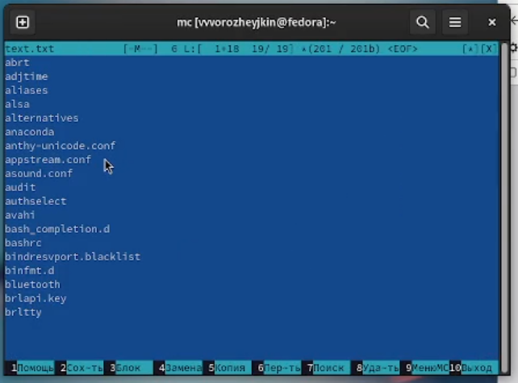
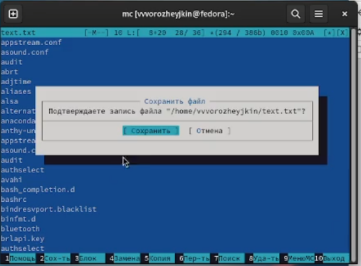
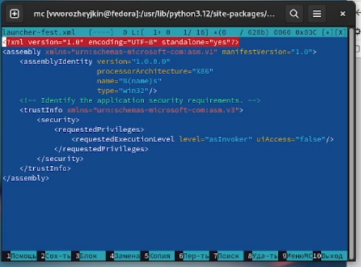

---
## Front matter
lang: ru-RU
title: Командная оболочка Midnight Commander.
subtitle: 
author: |
      Ворожейкин Владимир Вячеславович \inst{1}
  
institute:
 \inst{1}Российский университет дружбы народов, Москва, Россия
date: 6 апреля 2024, Москва, Россия

## Formatting
mainfont: PT Serif
romanfont: PT Serif
sansfont: PT Sans
monofont: PT Mono
toc: false
slide_level: 2
theme: metropolis
header-includes: 
 - \metroset{progressbar=frametitle,sectionpage=progressbar,numbering=fraction}
 - '\makeatletter'
 - '\beamer@ignorenonframefalse'
 - '\makeatother'
aspectratio: 43
section-titles: true

---

# Цели и задачи работы

## Цель лабораторной работы

Освоение основных возможностей командной оболочки Midnight Commander. Приоб-
ретение навыков практической работы по просмотру каталогов и файлов; манипуляций
с ними.

# Процесс выполнения лабораторной работы

## Открываю mc.

{ #fig:001 width=70% height=70% }

## Выделяю некоторые файлы

{ #fig:002 width=70% height=70% }

## Просматриваю содержимое файла

{ #fig:003 width=70% height=70% }

## Создаю каталог

{ #fig:004 width=70% height=70% }

## Произвожу поиск файла по необходимым критериям

{ #fig:005 width=70% height=70% }

## Создаю текстовый файл

{ #fig:006 width=70% height=70% }

## Добавляю в данный файл текст из другого файла

{ #fig:007 width=70% height=70% }

## Произвожу различные манипуляции с файлом с сохраняю его

{ #fig:008 width=70% height=70% }

## Открываю файл на языке программирования и включаю подсветку синтаксиса

{ #fig:009 width=70% height=70% }

## Вывод

Во время выполнения данной лабораторной работы я приобрел практические навыки в работе с mc и научился проводить манипуляции с файлами.
