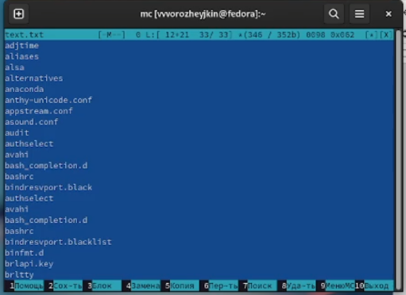

---
## Front matter
title: "Лабораторная работа №9"
subtitle: "Отчет"
author: "Ворожейкин Владимир Вячеславович"

## Generic otions
lang: ru-RU
toc-title: "Содержание"

## Bibliography
bibliography: bib/cite.bib
csl: pandoc/csl/gost-r-7-0-5-2008-numeric.csl

## Pdf output format
toc: true # Table of contents
toc-depth: 2
lof: true # List of figures
lot: true # List of tables
fontsize: 12pt
linestretch: 1.5
papersize: a4
documentclass: scrreprt
## I18n polyglossia
polyglossia-lang:
  name: russian
  options:
	- spelling=modern
	- babelshorthands=true
polyglossia-otherlangs:
  name: english
## I18n babel
babel-lang: russian
babel-otherlangs: english
## Fonts
mainfont: PT Serif
romanfont: PT Serif
sansfont: PT Sans
monofont: PT Mono
mainfontoptions: Ligatures=TeX
romanfontoptions: Ligatures=TeX
sansfontoptions: Ligatures=TeX,Scale=MatchLowercase
monofontoptions: Scale=MatchLowercase,Scale=0.9
## Biblatex
biblatex: true
biblio-style: "gost-numeric"
biblatexoptions:
  - parentracker=true
  - backend=biber
  - hyperref=auto
  - language=auto
  - autolang=other*
  - citestyle=gost-numeric
## Pandoc-crossref LaTeX customization
figureTitle: "Рис."
tableTitle: "Таблица"
listingTitle: "Листинг"
lofTitle: "Список иллюстраций"
lotTitle: "Список таблиц"
lolTitle: "Листинги"
## Misc options
indent: true
header-includes:
  - \usepackage{indentfirst}
  - \usepackage{float} # keep figures where there are in the text
  - \floatplacement{figure}{H} # keep figures where there are in the text
---

# Цель работы

Освоение основных возможностей командной оболочки Midnight Commander. Приобретение навыков практической работы по просмотру каталогов и файлов; манипуляций с ними.

# Задание

Изучить информацию о mc;
Изучить структуру mc;
Провести манипуляции с файлами;

# Выполнение лабораторной работы

 Изучаю информацию о mc, пользуясь соответствующей командой (рис.[-@fig:001]):

 {#fig:001 width=70% height=70%}
 
 Запускаю mc в терминале (рис.[-@fig:002]):

 {#fig:002 width=70% height=70%}
 
 Выполняю выделение файлов (рис.[-@fig:003]):

 {#fig:003 width=70% height=70%}

 Копирую каталог в другой каталог (рис.[-@fig:004]):

 {#fig:004 width=70% height=70%}

 Просматриваю информацию о файле (рис.[-@fig:005]):

 {#fig:005 width=70% height=70%}

 Копирую файл в каталог (рис.[-@fig:006]):

 {#fig:006 width=70% height=70%}

 Просматриваю содержимое каталога (рис.[-@fig:007]):

 {#fig:007 width=70% height=70%}
 
 Просматриваю содержимое файла (рис.[-@fig:008]):

 {#fig:008 width=70% height=70%}
 
 Создаю новый каталог (рис.[-@fig:009]):

 {#fig:009 width=70% height=70%}
 
 Создаю поиск файла с заданными условиями (рис.[-@fig:010]):

 {#fig:010 width=70% height=70%}
 
 Добавляю быстрый доступ к каталогу для быстрого перехода в домашний каталог (рис.[-@fig:011]):

 {#fig:011 width=70% height=70%}
 
 Вызываю подменю "Настройки" (рис.[-@fig:012]):

 {#fig:012 width=70% height=70%}
 
 Создаю файл text.txt (рис.[-@fig:013]):

 {#fig:013 width=70% height=70%}
 
 Просматриваю содержимое данного файла (рис.[-@fig:014]):

 {#fig:014 width=70% height=70%}
 
 Вставляю в данный файд текст из другого файла (рис.[-@fig:015]):

 {#fig:015 width=70% height=70%}
 
 Удаляю строку bluetooth с помощью соответствующей комбинации клавиш (рис.[-@fig:016]):

 {#fig:016 width=70% height=70%}
 
 Выделяю часть текста и переношу его на новую строку (рис.[-@fig:017]):

 {#fig:017 width=70% height=70%}
 
 Сохраняю файл (рис.[-@fig:018]):

 {#fig:018 width=70% height=70%}
 
 Перехожу в начало файла (рис.[-@fig:019]):

 {#fig:019 width=70% height=70%}
 
 Перехожу в конец файла (рис.[-@fig:020]):

 {#fig:020 width=70% height=70%}
 
 Снова сохраняю файл (рис.[-@fig:021]):

 {#fig:021 width=70% height=70%}
 
 Открываю файл на языке программирования. Вижу что в данном файле уже включен синтаксис(рис.[-@fig:022]):

 {#fig:022 width=70% height=70%}
 
# Выводы

Во время выполнения данной лабораторной работы я приобрел практические навыки в работе с mc и научился проводить манипуляции с файлами.

# Список литературы{.unnumbered}

::: https://esystem.rudn.ru/pluginfile.php/2288524/mod_resource/content/5/007-lab_mc.pdf
